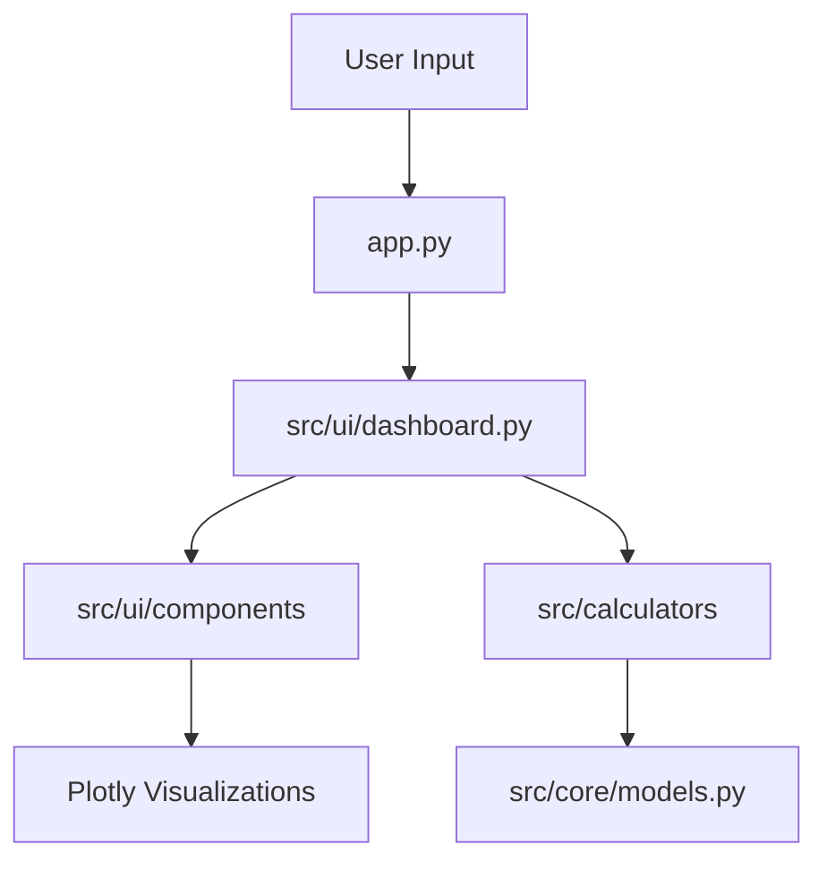

# System Architecture

The Software Metrics Calculator is built with a production-grade modular architecture that emphasizes high cohesion and low coupling.

## Directory Structure

- `app.py`: Minimal entry point for the Streamlit application.
- `src/`:
    - `core/`: Contains domain models and essential data structures (e.g., `CodeMetrics`).
    - `calculators/`: contains the core business logic and analysis algorithms.
        - `code_analyzer.py`: AST-based Python code analysis.
        - `estimation.py`: COCOMO modeling.
        - `agile.py`: Agile and sprint metrics processing.
    - `ui/`: Presentation layer logic.
        - `dashboard.py`: Main dashboard orchestration.
        - `components/`: Modular, reusable UI components (sidebar, charts, metrics cards).
    - `utils/`: Shared utility functions.

## Core Components

- **Domain Layer (`src/core`)**: Defines the data contracts used across the system, ensuring type safety and consistency.
- **Analysis Engine (`src/calculators`)**: Isolated logic for calculating software metrics. This separation allows for testing individual algorithms without UI overhead.
- **Presentation Layer (`src/ui`)**: Orchestrates the user interface using Streamlit, decoupled from the underlying analysis logic.

## Data Flow

